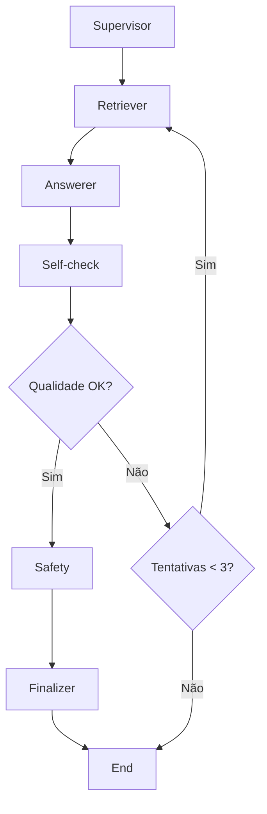

# Climate Assistant RAG System

Um assistente inteligente com RAG (Retrieval-Augmented Generation) + Agentes para questões de meio ambiente e mudanças climáticas, baseado em documentos do IPCC.

## 🌍 Visão Geral

Este sistema implementa uma prova de conceito (PoC) de um assistente com:
- **RAG**: Recuperação de informações de documentos científicos
- **Agentes LangGraph**: Orquestração inteligente de múltiplos agentes especializados
- **Anti-alucinação**: Sistema de verificação e citações obrigatórias
- **Foco Ambiental**: Especializado em mudanças climáticas e meio ambiente

## 🏗️ Arquitetura do Sistema

### Arquitetura do Grafo de Agentes

O sistema utiliza LangGraph para orquestrar um pipeline de agentes especializados:



#### Agentes Especializados

1. **Supervisor**: Roteamento e gerenciamento de consultas
2. **Retriever**: Busca e recuperação de documentos relevantes
3. **Answerer**: Geração de respostas com citações obrigatórias
4. **Self-check**: Verificação de qualidade e evidências
5. **Safety**: Adição de disclaimers e verificações de segurança
6. **Finalizer**: Formatação final

### Stack Tecnológica
- **Python 3.8+**
- **LangChain + LangGraph**: Orquestração de agentes
- **Ollama**: LLM open-weights (Llama 3.1 8B, Qwen2.5 7B, etc.)
- **FAISS/Chroma**: Armazenamento vetorial
- **HuggingFace Embeddings**: Embeddings de texto
- **Flask**: API REST compatível com frontend existente
- **RAGAS**: Sistema de avaliação de qualidade

## 📁 Estrutura do Projeto

```
backend/
├── README.md              
├── LICENSE                
├── CITATION.cff         
├── Dockerfile            
├── requirements.txt     
├── setup.py             
├── src/                 
│   ├── __init__.py
│   ├── agents.py      
│   └── config.py        
├── app/                 
│   ├── __init__.py
│   └── app.py          
├── ingest/              
│   ├── __init__.py
│   └── document_processor.py
├── eval/                
│   ├── __init__.py
│   └── evaluation.py
├── tests/               
│   ├── __init__.py
│   ├── test_agents.py
│   ├── test_document_processor.py
│   └── test_config.py
├── data/                
│   ├── documents/      
│   ├── vector_store/   
│   └── evaluation/     
└── static/             
    ├── pln.html
    ├── seta.png
    └── styles.css
```

## 🚀 Setup e Instalação

### Pré-requisitos
- Python 3.8 ou superior
- Ollama instalado e configurado
- 8GB+ RAM recomendado

### 1. Instalação Automática
```bash
cd backend
python setup.py
```

### 2. Instalação Manual

#### Instalar dependências Python:
```bash
pip install -r requirements.txt
```

#### Instalar e configurar Ollama:
```bash
# Instalar Ollama (https://ollama.ai/)
# Baixar modelo LLM
ollama pull llama3.1:8b
# ou
ollama pull qwen2.5:7b
```

#### Processar documentos:
```bash
python -m ingest.document_processor
```

#### Iniciar servidor:
```bash
python -m app.app
```

### 3. Executar Testes

```bash
# Executar todos os testes
python -m pytest tests/

# Executar testes específicos
python -m pytest tests/test_agents.py
python -m pytest tests/test_document_processor.py
python -m pytest tests/test_config.py
```

## 📊 Dados e Fontes

### Fontes de Documentos

O sistema indexa automaticamente:

1. **Relatórios do IPCC AR6**:
   - Synthesis Report
   - Working Group I (Physical Science Basis)
   - Working Group II (Impacts, Adaptation and Vulnerability)
   - Working Group III (Mitigation of Climate Change)

### Processamento de Dados

- **Chunking**: Divisão de documentos em segmentos de 1000 caracteres
- **Overlap**: Sobreposição de 200 caracteres entre chunks
- **Embeddings**: Geração de vetores usando Ollama embeddings
- **Indexação**: Armazenamento em FAISS ou Chroma

### Estrutura de Dados

```json
{
  "documents": [
    {
      "content": "Texto do documento...",
      "metadata": {
        "source": "IPCC AR6 Synthesis Report",
        "url": "https://www.ipcc.ch/report/ar6/syr/",
        "type": "website",
        "chunk_id": 1,
        "chunk_size": 1000
      }
    }
  ]
}
```

## 📈 Métricas e Avaliação

### Métricas Implementadas

#### RAGAS (RAG Assessment)
- **Faithfulness**: Fidelidade às fontes (meta: > 0.8)
- **Answer Relevancy**: Relevância da resposta (meta: > 0.7)
- **Context Precision**: Precisão do contexto (meta: > 0.6)
- **Context Recall**: Cobertura do contexto (meta: > 0.6)

#### Métricas de Performance
- **Latência**: Tempo médio de resposta (meta: < 5s)
- **Throughput**: Consultas por minuto
- **Disponibilidade**: Uptime do sistema

#### Métricas de Qualidade
- **Citações**: Presença de citações (meta: > 80%)
- **Anti-alucinação**: Verificação de evidências
- **Consistência**: Coerência entre respostas similares

### Dataset de Avaliação

- **20+ perguntas** sobre mudanças climáticas
- **Respostas rotuladas** manualmente
- **Métricas automáticas** de qualidade
- **Benchmarks** de performance

### Executar Avaliação

```bash
# Avaliação completa
python -m eval.evaluation

# Avaliação específica
python -c "
from eval.evaluation import ClimateAssistantEvaluator
from ingest.document_processor import DocumentProcessor
from src.agents import ClimateAssistantAgents

# Inicializar componentes
doc_processor = DocumentProcessor()
doc_processor.load_vector_store()
agents = ClimateAssistantAgents(doc_processor)

# Executar avaliação
evaluator = ClimateAssistantEvaluator(doc_processor, agents)
results = evaluator.run_comprehensive_evaluation()
print(results)
"
```

## 📊 Uso da API

### Endpoints Principais

#### `/get_response` (POST)
Endpoint principal para chat, compatível com frontend existente.

**Request:**
```json
{
  "messages": [
    {"role": "user", "content": "Quais são as principais evidências do aquecimento global?"}
  ]
}
```

**Response:**
```json
{
  "response": "Resposta com citações...",
  "response_html": "<p>Resposta formatada em HTML...</p>",
  "metadata": {
    "citations_count": 3,
    "retrieved_docs_count": 5,
    "citations": [...]
  }
}
```

#### `/search` (POST)
Busca direta em documentos.

#### `/status` (GET)
Status do sistema.

#### `/health` (GET)
Health check.

#### `/reload` (POST)
Recarregar o sistema (útil para desenvolvimento).

### Exemplo de Uso
```python
import requests

# Fazer pergunta sobre mudanças climáticas
response = requests.post('http://localhost:5000/get_response', json={
    'messages': [
        {'role': 'user', 'content': 'Como o IPCC define mudanças climáticas?'}
    ]
})

print(response.json()['response'])
```

## 🔧 Configuração

### Variáveis de Ambiente
```bash
# LLM Configuration
OLLAMA_BASE_URL=http://localhost:11434
LLM_MODEL=llama3.1:8b
EMBEDDING_MODEL=sentence-transformers/all-MiniLM-L6-v2

# Vector Store
VECTOR_STORE_TYPE=faiss  # ou chroma
CHUNK_SIZE=1000
CHUNK_OVERLAP=200

# API
API_HOST=localhost
API_PORT=5000
DEBUG=False

# Agent Configuration
MAX_ITERATIONS=10
TEMPERATURE=0.1
```

## 🐳 Docker

### Construir e Executar
```bash
# Construir imagem
docker build -t climate-assistant .

# Executar container
docker run -p 5000:5000 climate-assistant

# Com docker-compose
docker-compose up --build
```

### Docker Compose

```yaml
version: '3.8'
services:
  climate-assistant:
    build: .
    ports:
      - "5000:5000"
    environment:
      - OLLAMA_BASE_URL=http://localhost:11434
      - LLM_MODEL=llama3.1:8b
    volumes:
      - ./data:/app/data
```

## 🧪 Desenvolvimento

### Estrutura de Desenvolvimento

```bash
# Instalar dependências de desenvolvimento
pip install -r requirements.txt

# Executar testes
python -m pytest tests/ -v

# Executar linting
python -m flake8 src/ app/ ingest/ eval/

# Executar type checking
python -m mypy src/ app/ ingest/ eval/
```

# Adicionar ao grafo
workflow.add_node("new_agent", self.new_agent)
workflow.add_edge("previous_agent", "new_agent")
```

### Adicionando Novas Fontes

```python
# src/config.py
DOCUMENT_SOURCES.append({
    "name": "Nova Fonte",
    "url": "https://example.com",
    "type": "website"
})
```

## 🤝 Contribuição

### Desenvolvimento
1. Fork o repositório
2. Crie uma branch para sua feature
3. Implemente testes
4. Execute avaliação completa
5. Submeta pull request

### Melhorias Futuras
- [ ] Suporte a mais idiomas
- [ ] Integração com mais fontes de dados
- [ ] Interface web melhorada
- [ ] Métricas em tempo real
- [ ] Cache inteligente
- [ ] Suporte a documentos PDF
- [ ] API GraphQL
- [ ] Autenticação e autorização

## 📄 Licença

Este projeto é open-source e está disponível sob a licença MIT. Veja o arquivo [LICENSE](LICENSE) para mais detalhes.

## 🆘 Suporte

### Problemas Comuns

#### Ollama não responde
```bash
# Verificar se está rodando
ollama list

# Reiniciar serviço
ollama serve
```

#### Erro de memória
- Reduza o tamanho do modelo LLM
- Use chunk_size menor
- Aumente RAM disponível

#### Documentos não carregam
- Verifique conexão com internet
- Confirme URLs das fontes
- Execute `python -m ingest.document_processor` novamente

#### Erros de importação
- Verifique se está executando do diretório correto
- Use `python -m` para executar módulos
- Verifique se todos os `__init__.py` estão presentes

### Logs
```bash
# Ver logs detalhados
tail -f logs/climate_assistant.log

# Logs do Docker
docker logs climate-assistant
```

## 📚 Referências

- [LangChain Documentation](https://python.langchain.com/)
- [LangGraph Documentation](https://langchain-ai.github.io/langgraph/)
- [Ollama Documentation](https://ollama.ai/docs)
- [IPCC Reports](https://www.ipcc.ch/reports/)
- [RAGAS Evaluation](https://github.com/explodinggradients/ragas)
- [FAISS Documentation](https://faiss.ai/)
- [Chroma Documentation](https://docs.trychroma.com/)

---
